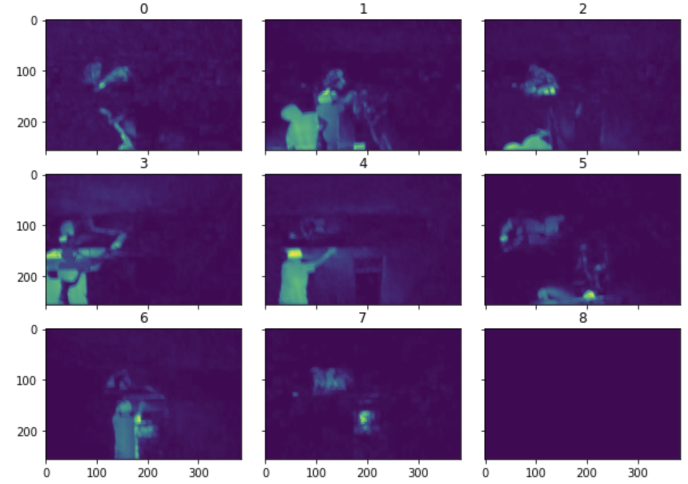
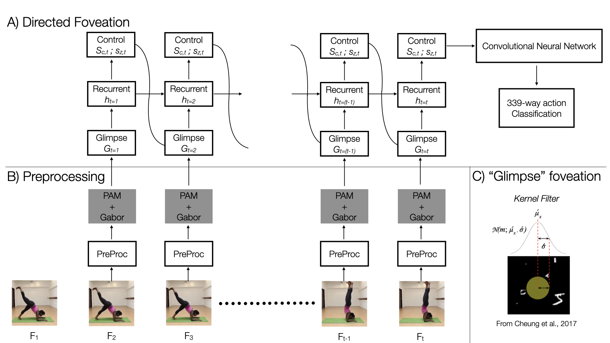

# fove8n [WIP]
### _("foveation")_
#

Deep neural networks (DNNs) optimized for object recognition are the best models of the the human visual system. All such models are trained on still images and optimized over millions of samples. However, unlike object recognition DNNs, the human visual system receives inputs in both the spatial and temporal domain. In the spatial domain, items that are foveated are over-sampled whereas items in the periphery are undersampled. Further, not every spatial point is sampled at the same rate -- that is the retinal ganglion cells do not fire synchronously across space, rather they fire asynchronously continuously sampling the environment in both the spatial and temporal domains. Thus, the goal of this proposal is to update biologically-inspired models of vision such that they are trained and optimized on input that is contiguous over space and time (i.e., videos rather than still images).

Our approach to build a new DNN will be guided by the way the retina samples the environment and the way primary visual cortex processes visual input. The architecture will merge a Persistence of Appearance (PA) module (from the [PAN network](https://github.com/zhang-can/PAN-PyTorch)), a method that is more computationally efficient and accurate than existing optical flow methods with a recurrent neural network architecture that is designed to prioritize areas of motion within a frame. We hope that that the PA frames will guide the sampling location from each video, thus reducing the computational demand of processing videos. In addition, we expect this design will reproduce an attention-like effect (i.e., pattern of saccades) during input-processing.

Example output from applying the PA module

Original Architecture Idea